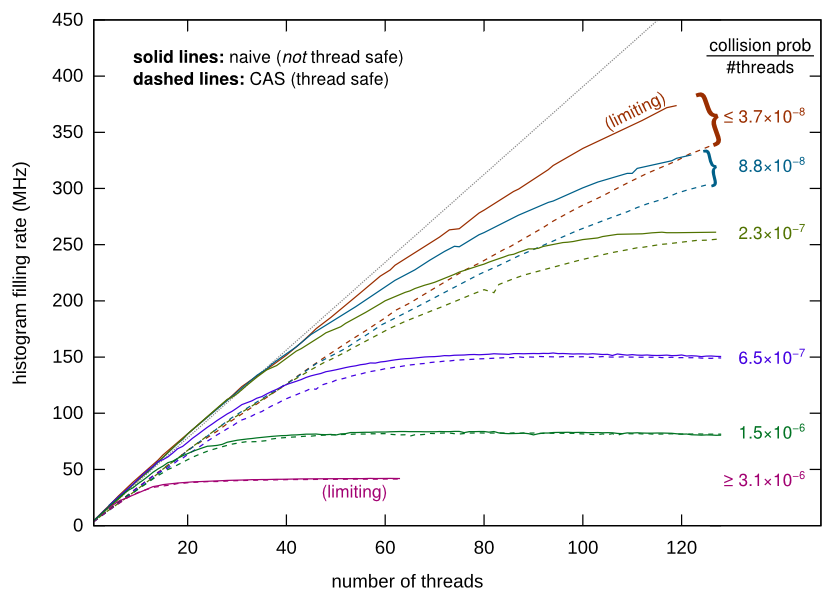
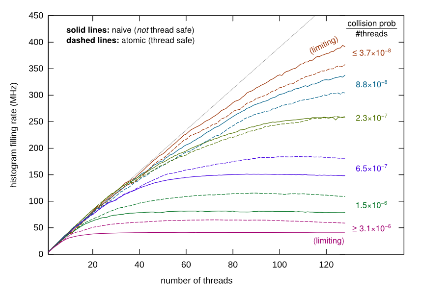

# Parallel histogram metrics

This directory contains all of the code and results behind my June 1, 2017 talk at the [ROOT PPP meeting](https://indico.cern.ch/event/607830/). See [my slides](https://github.com/diana-hep/parallel-histogram-metrics/blob/master/talk-2017-06-01-rootppp/main.pdf) for a motivation and overview of the study. The bottom line plots are shown below.





## Repeating the study

**Step 1:** find a machine with lots of cores. I used a KNL at Princeton; results and cpuinfo dumps are in `results_mcmillan-r1k1.princeton.edu`.

**Step 2:** copy over `randomfill.cpp` and `randomfill.py`, which are the only two files needed for the test.

**Step 3:** compile the C++ code into a shared library:

```
gcc -std=c++11 -shared -fPIC -lstdc++ -lrt -O3 randomfill.cpp -o randomfill.so
```

(No, there's no Makefile.)

**Step 4:** configure the Python script to run the appropriate test. Currently, that's chosen by uncommenting the appropriate `experiment` line:

```
# experiment = numpy.random.permutation([(i, "naive", RunNaive) for i in range(1, 128+1)] + [(i, "cassafe", RunCASSafe) for i in range(1, 128+1)])   # [(128, "cassafe", RunCASSafe)]
# experiment = numpy.random.permutation([(i, "naive", RunNaive) for i in range(1, 64+1)] + [(i, "cassafe", RunCASSafe) for i in range(1, 64+1)])

experiment = numpy.random.permutation([(i, "naive", RunNaive) for i in range(1, 128+1)] + [(i, "atomic", RunAtomic) for i in range(1, 128+1)])
```

The uncommented one runs the "naive" test on 1–128 cores (inclusive) and the "atomic" test on 1–128 cores (inclusive), all in a random order (so that the control and experiment are interleaved). RunCasSafe is a different option.

**Step 5:** further configure the experiment with command-line options.

   * `size`: number of GB for the shared block of memory, to be interpreted as a minimalist histogram.
   * `trials`: number of bin-increment evnets in a single wall-time measurement (C++ `gettimeofday`).
   * `cardinality`: powers of 2 to reduce the size of the set of bins that might be hit. This is to increase the collision rate.

```
size = int(int(sys.argv[1]) * 1024**3 / 8)    # 1024**3 / 8 == 2**27
trials = int(float(sys.argv[2]))
cardinality = size >> int(sys.argv[3])
```

Results in `results_mcmillan-r1k1.princeton.edu` are labeled by command-line arguments and then sorted for plotting.


